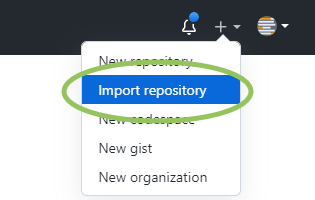
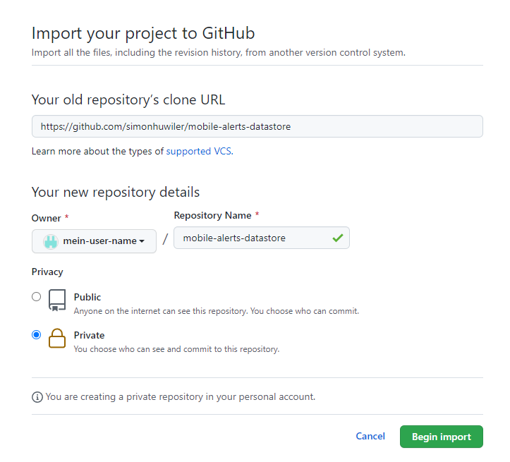
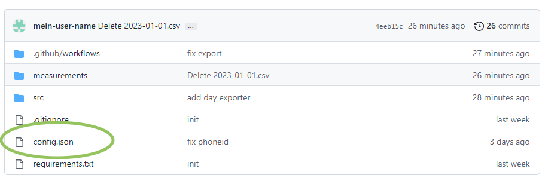
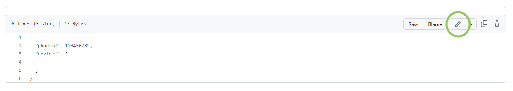
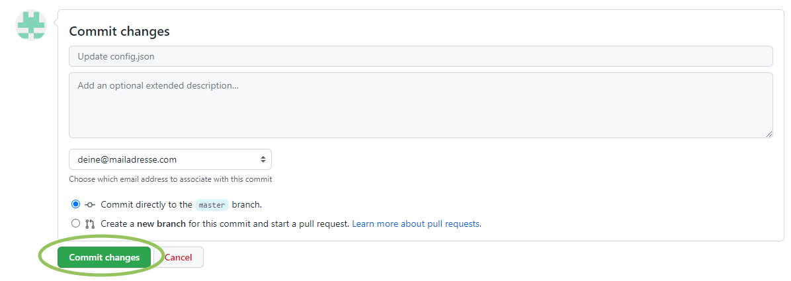
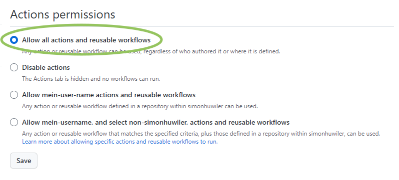
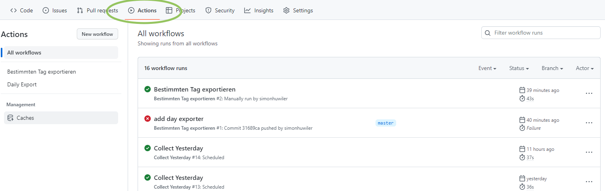

# Automatisierter Datenexport für Mobile Alerts Sensoren
Du möchtest Deine Sensordaten regelmässig exportieren, hast jedoch keinen Server? Hier erklär ich Dir, wie Du einfach Deine Daten täglich vollautomatisch und kostenlos exportieren kannst. Du brauchst kein technisches Knowhow dazu.

## Anleitung
### 1. Bei GitHub registrieren
GitHub ist eine Ablage für Code, die vor allem von Programmiererinnen und Programmierern genutzt wird. Wir nutzen GitHub als automatisierten Server für den Export.

Registriere Dich bei [GitHub](https://github.com/) und logge Dich ein.

### 2. Kopie dieses Repositories anlegen
Nun musst Du eine Kopie [dieses aktuelle Repository](https://github.com/simonhuwiler/mobile-alerts-datastore) in Deinem Konto anlegen. Klicke dazu rechts oben auf das `+`, dann auf `Import Repository`. Du kannst auch einen Fork anlegen, dann sind die Daten Deiner Sensoren jedoch öffentlich zugänglich.



Fülle das Formular wie folgt aus:

**Your old repository’s clone URL**  
`https://github.com/simonhuwiler/mobile-alerts-datastore`

**Repository Name**  
Vergib einen Namen, z.B. `mobile-alerts-datastore`

**Privacy**  
Wenn Du nicht willst, dass die Daten Deiner Sensoren für alle sichtbar sind, wähle `Private`. Ansonsten `Public`.

Klicke nun auf `Begin import` und warte, bis der Import abgeschlossen ist.



### 3. Sensoren eintragen
Öffne nun Dein neu erstelltes Repository. Entweder über den Link, der nach dem Import angezeigt wird, oder indem Du rechts oben auf das `+`, `Your Repositories` klickst und das entsprechende Repository auswählst.

Du siehst nun oben alle Dateien im Repository. Klicke auf die Datei `config.json` und danach auf den Bleistift (`Edit this file`).





Gib bei `phoneid` die ID Deines Gerätes ein. Du findest sie in der Mobile-Alerts-App in den Einstellungen unter `Phone ID`.

Unter `devices` kannst Du Deine Sensoren hinterlegen, jeweils mit Anführungszeichen. Die Datei sollte danach in etwa so aussehen.
```json
{
  "phoneid": 533832871596,
  "devices": [
    "03621FD51359",
    "026857798345"
  ]
}
```

Speichere die Datei, in dem Du unten auf `Commit changes` klickst.



### 4. Aktiviere Actions
In diesem Repository sind Actions hinterlegt, die zeitgesteuert die Daten exportieren. Diese Funktion ist jedoch deaktiviert, weil Du ein fremdes Repository importiert hast. Aktiviere sie wie folgt:

Klicke auf `Settings`, dann `Actions` und `General`.

Unter `Action permissions` wähle `Allow all actions and reusable workflows` und klicke auf `Save`.




## Was passiert nun?
Der GitHub-Server wird nun automatisch um zwei Uhr Nachts die Daten Deiner Sensoren als CSV exportieren.

## Wo liegen meine Daten?
Du findest Deine Daten im Ordner `measurements/[sensor-id]`.

## Welches Format haben meine Daten?
Dieser Export speichert die Daten so, wie sie von Mobile Alerts kommen. Du findest weitere Informationen in ihrer [Api-Dokumentation](https://mobile-alerts.eu/info/public_server_api_documentation.pdf).

## Wie bekomme ich die Daten auf meinen Computer?
Du kannst eine einzelne Datei anklicken und herunterladen. Wenn Du das Repository mit Deinem Computer synchronisieren willst, dann clone das Git-Repo. Sollte Git für Dich neu sein:
* Installiere [GitHub Desktop](https://desktop.github.com/)
* Logge Dich ein
* Wähle Dein erstelltes Repository aus

Danach werden Deine Daten mit Deinem Computer synchronisiert. Um den Ordner auf Deinem Computer jeweils zu aktualisieren, musst Du GitHub Desktop öffnen und die Synchronisation anstossen.

## Wie funktioniert der Export?
In Deinem GitHub-Repository liegen zwei Actions. Das sind Scripte, die automatisch ausgeführt werden. Sie liegen im Ordner `.github\workflows`:
* `daily-export.yml` wird täglich in der Nacht ausgeführt und exportiert jeweils den Vortag. Öffne die Datei für weitere Informationen
* `export-day.yml` kann manuell ausgeführt werden, um einen spezifischen Tag zu exportieren

Du siehst die Action, wann sie zuletzt liefen und ob sie erfolgreich waren, im Tab `Actions`.



## Der Mobile Alerts-Server war zum Exportzeitpunkt offline. Kann ich die Daten nachträglich exportieren?
Ja, du hast zwei Möglichkeiten:

Führe die Action `Daily Export` erneut aus, um den **Vortag** zu exportieren. Klicke dazu oben auf `Actions`, dann links auf `Daily Export`, dann rechts auf `Run Workflow` (2x). Du siehst, wie die Action startet.

Liegt der Tag schon weiter zurück, dann klicke in der Actions-Übersicht auf `Bestimmten Tag exportieren`, dann auf `Run Workflow`. Gib das Datum (Format: Jahr-Monat-Tag) ein und klicke auf `Run Workflow`.

## Die Action generiert einen Fehler
Klicke auf die fehlgeschlagene Action für weitere Informationen. Du kannst auch [ein Issue hier](https://github.com/simonhuwiler/mobile-alerts-datastore/issues) erstellen.

## Ich will eine schönere Übersicht für meine Sensoren.
Schaue Dir [dieses Projekt](https://github.com/simonhuwiler/mobilealerts-client) an.